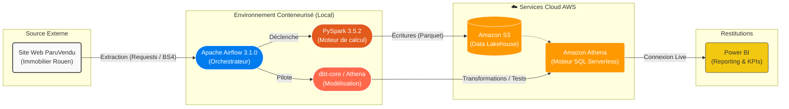
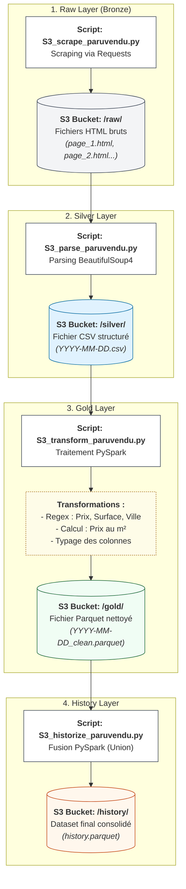
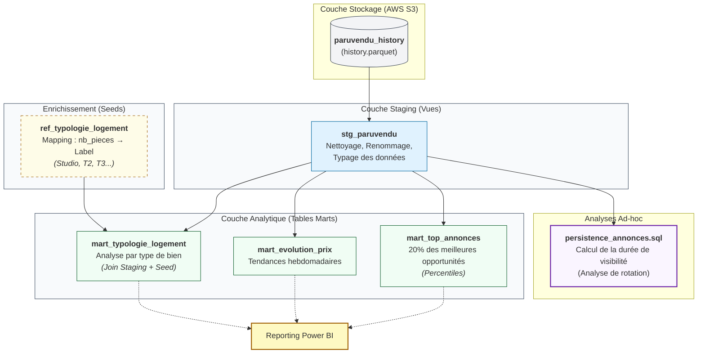
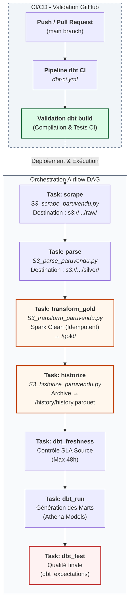

# Projet Data Engineering – Pipeline Immobilier ParuVendu

## Sommaire
- [Contexte et Objectifs](#contexte-et-objectifs)
- [Périmètre Fonctionnel](#perimetre-fonctionnel)
- [Architecture Globale](#architecture-globale)
- [Stack Technique](#stack-technique)
- [Flux de Données & Médaillon](#flux-de-donnees-medaillon)
- [Stockage & Stratégie Analytique](#stockage-strategie-analytique)
- [Fiabilité & Orchestration](#fiabilite-orchestration)
- [Observabilité & Qualité](#observabilite-qualite)
- [Valeur Ajoutée & Compétences](#valeur-ajoutee-competences)
- [Axes d'Amélioration](#axes-amelioration)


<a id="contexte-et-objectifs"></a>
## Contexte et Objectifs
Ce projet illustre la conception d'un pipeline de données automatisé pour la collecte et l'analyse des annonces immobilières du site ParuVendu (région de Rouen). L'objectif est de transformer une donnée web brute en indicateurs décisionnels via une architecture moderne de Data Engineering.

Le système répond à deux impératifs majeurs :

- **Automatisation (Batch)** : Extraction hebdomadaire sans intervention humaine via un système d'orchestration robuste.
- **Analytique (Historique)** : Suivi de l'évolution des prix et de la persistance des annonces pour identifier les opportunités du marché.

L'architecture met l'accent sur la modularité, le traitement distribué avec PySpark et la modélisation rigoureuse avec dbt.

<a id="perimetre-fonctionnel"></a>
## Périmètre Fonctionnel

Le système assure les fonctions suivantes :

- **Ingestion Automatisée** : Scraping de pages HTML et stockage immuable sur AWS S3.
- **Traitement Distribué** : Nettoyage et enrichissement des données (extraction de prix, surface, ville via Regex) avec PySpark.
- **Historisation Temporelle** : Consolidation des snapshots pour permettre une analyse de tendance sur le long terme.
- **Modélisation métier** : Création de tables de faits et de dimensions (Marts) pour le reporting.

<a id="architecture-globale"></a>
## Architecture Globale
L'architecture suit un modèle de Data Lakehouse où AWS S3 sert de stockage central et AWS Athena de moteur de calcul SQL pour la couche finale.

**Graphe 1 : Vue d'ensemble des composants**  


### Structure du Projet
L’arborescence est segmentée par responsabilité technique :

```text
├── .github/workflows/ # CI/CD pour dbt
├── dags/
│   ├── scripts/ # Logique PySpark (Scrape, Parse, Transform, Historize)
│   ├── dbt/ # Modélisation SQL & Tests
│   └── paruvendu_pipeline.py # Orchestration Airflow
├── Dockerfile # Environnement Spark/Airflow/dbt
└── docker-compose.yaml # Infrastructure conteneurisée
```
<a id="stack-technique"></a>
## Stack Technique


Le choix technologique privilégie des outils standards du marché pour assurer la scalabilité :

- Orchestration : Apache Airflow 3.1.0.
- Traitement de Données : PySpark 3.5.2.
- Modélisation & T-ELT : dbt-core 1.10.13 & dbt-athena-community.
- Stockage Cloud : AWS S3 (Data Lake) & AWS Athena.
- Qualité & Tests : dbt_expectations.
- Infrastructure : Docker & GitHub Actions.

<a id="flux-de-donnees-medaillon"></a>
## Flux de Données & Médaillon


Le pipeline suit l'architecture Medallion, garantissant une traçabilité totale de la donnée.

**Graphe 2 : Cycle de vie de la donnée (Medallion)**  


Le flux se décompose ainsi :

- Raw (Bronze) : Stockage des fichiers HTML bruts datés.
- Silver : Conversion en CSV structuré.
- Gold : Nettoyage PySpark (Regex, typage, calcul prix/m²).
- History : Fusion des fichiers Gold en un historique Parquet unique sur S3.

<a id="stockage-strategie-analytique"></a>
## Stockage & Stratégie Analytique


L'usage de dbt sur Athena permet de découpler le stockage de la logique métier.

- Enrichissement (Seeds) : Intégration de référentiels pour mapper le nombre de pièces aux typologies de logement (T2, T3, etc.).
- Analyse de Persistance : Mesure de la durée de présence des annonces pour détecter les biens à forte rotation.

**Graphe 3 : Couches de modélisation dbt**  


<a id="fiabilite-orchestration"></a>
## Fiabilité & Orchestration


Pour garantir la résilience du pipeline, chaque étape est isolée et monitorée.

- Idempotence : Les scripts Spark sont conçus pour traiter les partitions quotidiennes de manière indépendante.
- CI/CD : Un workflow GitHub Actions valide chaque modification de modèle dbt et exécute les tests avant le déploiement.

**Graphe 4 : Workflow d'Orchestration (DAG)**  

<a id="observabilite-qualite"></a>
## Observabilité & Qualité


La confiance dans la donnée est assurée par deux mécanismes clés :

- Freshness dbt : Contrôle automatique que les données sources sur S3 ne datent pas de plus de 48h.
- Tests d'Intégrité : Validation via dbt_expectations que les prix sont positifs, les surfaces réalistes et les identifiants uniques.

<a id="valeur-ajoutee-competences"></a>
## Valeur Ajoutée & Compétences


Ce projet démontre une expertise sur l'ensemble du cycle de vie de la donnée :

- ✅ Architecture Cloud : Gestion de Data Lake sur AWS S3.
- ✅ Big Data Processing : Maîtrise de PySpark pour le nettoyage complexe de données non structurées.
- ✅ Modern Data Stack : Utilisation intensive de dbt pour la gouvernance et la modélisation.
- ✅ DevOps for Data : Automatisation via Docker et GitHub Actions.

<a id="axes-amelioration"></a>
## Axes d'Amélioration


- Alerting : Intégration de notifications Slack/Email sur échec de tâche Airflow.
- Schema Registry : Utilisation de formats comme Glue Schema Registry pour valider la structure en entrée.
- Scalabilité Cloud : Migration vers AWS MWAA pour un Airflow managé.
